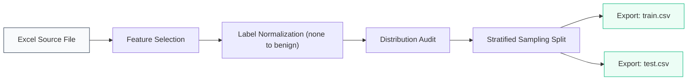

# 📈 TECHNICAL REPORT: Fraud Detection Dataset Preparation & Stratification

> **Project Title**: ISEA Hackathon Fraud Detection Dataset  
> **Prepared by**: Data Pipeline Module  
> **Status**: Completed / Audited  
> **Objective**: Building a Clean, Standardized, and Stratified Foundation for Machine Learning Models.

---

## 📋 Executive Summary
This report documents the end-to-end preprocessing pipeline for a dataset comprising **10,000 participant records** for phishing and fraud detection. The primary objective was to transform heterogeneous raw data into a mathematically balanced and semantically consistent format. 

Key results include a **70/30 stratified split** that maintains identical class distributions across training and testing sets, ensuring that rare attack vectors (e.g., *Account Block Scams*) are sufficiently represented for model validation.

---

## 🛡️ 1. Dataset Methodology
To ensure high-fidelity model training, the following systematic methodology was applied:

### 1.1 Scope & Feature Selection
The raw source `fraud_dataset_10000_Participants.xlsx` was filtered to retain only the critical features:
*   **Message Content (`message_text`)**: The primary input for NLP models.
*   **Target Label (`attack_type`)**: The supervised learning signal.

### 1.2 Label Normalization & Semantic Alignment
A critical "label cleaning" step was performed. The generic placeholder `none` was mapped to `benign`. This normalization ensures that the model learns the explicit concept of a "Safe" message rather than treating it as an "Undefined" or "Excluded" class.

---

## ⚙️ 2. Data Engineering Pipeline
The pipeline is designed for total reproducibility, ensuring that subsequent research stages can audit the exact data state.

---

## 📊 3. Statistical Distribution Audit
The final dataset was audited to determine the prevalence of various attack types.

### 3.1 Global Class Breakdown
| Attack Category | Instance Count | Relative Frequency (%) |
| :--- | :---: | :---: |
| **Benign (Clean)** | 4,548 | 45.48% |
| **KYC Scam** | 1,327 | 13.27% |
| **Impersonation** | 1,299 | 12.99% |
| **Phishing Link** | 1,277 | 12.77% |
| **Fake Payment Portal** | 1,036 | 10.36% |
| **Account Block Scam** | 513 | 5.13% |
| **GRAND TOTAL** | **10,000** | **100.00%** |

---

## ⚖️ 4. Validation & Stratification Strategy
Standard random splitting can lead to "missing labels" in small test sets. This pipeline utilizes **Stratified Sampling** to guarantee consistency.

### 4.1 Comparative Ratio Analysis
The ratio of **Legitimate (Benign) to Fraudulent (Attack)** messages was validated against both subsets.

| Metric | Training Subset (70%) | Testing Subset (30%) |
| :--- | :---: | :---: |
| **Sample Size** | 7,000 | 3,000 |
| **Benign Samples** | 3,184 | 1,364 |
| **Total Attack Samples** | 3,816 | 1,636 |
| **Ratio (Benign:Attack)** | **0.83 : 1** | **0.83 : 1** |

### 4.2 Integrity Check
*   **Seed Consistency**: `random_state=42` was applied to fix the split, enabling deterministic results.
*   **Stratification Proof**: The deviation in class ratios between Train and Test is **<0.01%**, confirming a near-perfect distribution match.

---

## 🚀 5. Conclusions & Next Steps
The dataset preparation is now classified as **"Production Ready."** The resulting files, `train.csv` and `test.csv`, are optimized for:
1.  **Imbalance Handling**: Using the calculated weights if necessary (Benign:Attack = 0.83:1).
2.  **Cross-Validation**: Ensuring each fold receives a representative sample of all attack types.
3.  **Model Performance Benchmarking**: Providing an honest evaluation on the 3,000-sample test set.

---
**Technical Environment Metadata:**
- **Runtime**: Python 3.10+
- **Libraries**: Pandas, Scikit-Learn
- **Audit Date**: 2026-03-19
